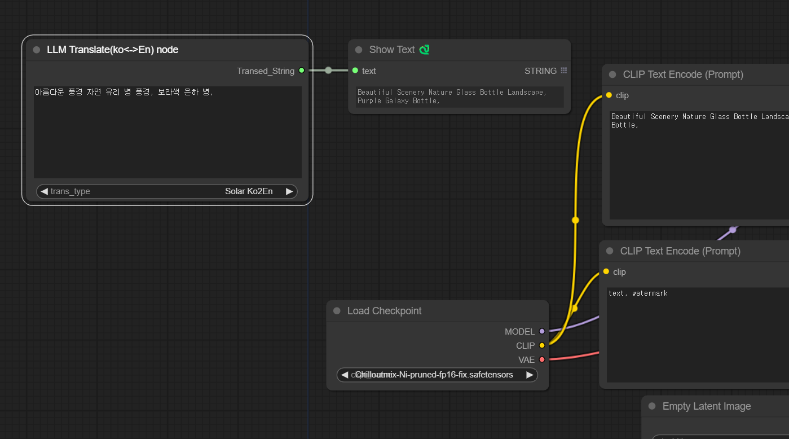
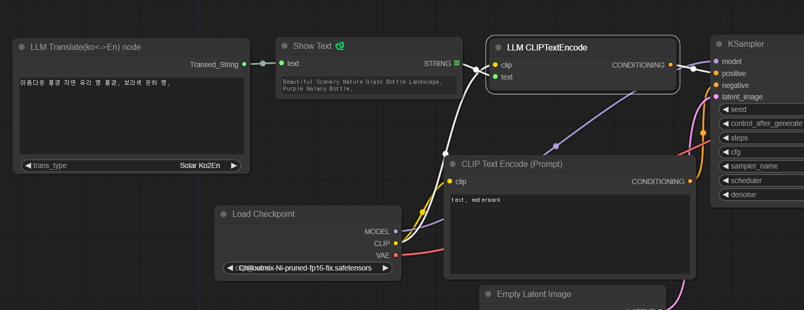

# ComfyUI Korean to English translation prompt with Solar beta

This project is a ComfyUI version to Korean to English translattion prompt. 

Solar API is the best and fastest Korean to English translation LLM-based API by Upstage. 

Drag and drop the image below into ComfyUI and it will be automatically configured. 

It can translate Korean to English as well as English to Korean.

This is a beta API, so you'll need to register for the full API later.

## Usage 1 : Only View translated text 
You can copy and paste translated text to prompt(in CLIP text) and can change text

## Usage 2 : Translation to Prompt (in CLIP text)  
This is done by automatically passing the translated text to the prompt (in CLIP text).   

## Reference

Solar API  https://console.upstage.ai  
