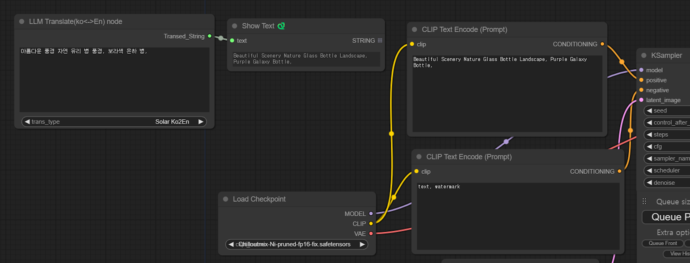

# ComfyUI Korean to English translate prompt with Solar

This project is a ComfyUI version to translate prompt. 

Solar API is the best Korean to English and English to Korean translate LLM API by Upsatge. 

Drag and drop the image below into ComfyUI and it will be automatically configured. 

## Usage 1 : Only View translate text 
You copy and paste transed text to prompt(in CLIP text) and can change text

## Usage 2 : Translate to Prompt (in CLIP text)  
This is done by automatically passing the translated text to the prompt (in CLIP text).   

## Reference

Solar API  https://console.upstage.ai  

